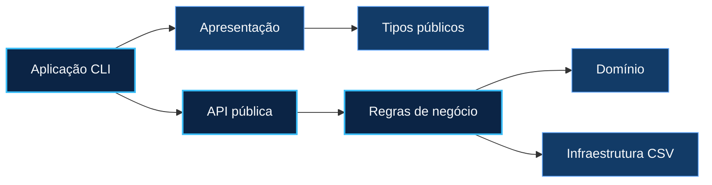

<p align="center">
  
</p>

<p align="center">
  <strong>Um simulador bancário de terminal, modular, persistente e sem dependências externas.</strong>
</p>

<p align="center">
  
  
  
  
</p>

<p align="center">
  <a href="#visão-geral">Visão geral</a> •
  <a href="#recursos">Recursos</a> •
  <a href="#arquitetura">Arquitetura</a> •
  <a href="#início-rápido">Início rápido</a> •
  <a href="#persistência">Persistência</a> •
  <a href="#escopo">Escopo</a>
</p>

---

## Visão geral

O **Banco Malvezzi** implementa o ciclo essencial de contas e movimentações financeiras em C11. A aplicação roda inteiramente no terminal, mantém o estado em arquivos CSV e separa interface, regras de negócio, domínio e infraestrutura em módulos independentes.

<table>
  <tr>
    <td align="center" width="33%">
      <strong>💸 Valores exatos</strong><br>
      <sub>Dinheiro representado em centavos inteiros, sem erros de ponto flutuante.</sub>
    </td>
    <td align="center" width="33%">
      <strong>🧩 Código modular</strong><br>
      <sub>API pública enxuta e detalhes internos separados por responsabilidade.</sub>
    </td>
    <td align="center" width="33%">
      <strong>🛡️ Estado recuperável</strong><br>
      <sub>Gravação temporária e journal para retomar operações após interrupção do processo.</sub>
    </td>
  </tr>
</table>

## Recursos

| Área | O que está disponível |
|---|---|
| **Contas** | abertura, consulta, atualização e encerramento lógico |
| **Movimentações** | depósito, saque, transferência e pagamento com débito imediato |
| **Consultas** | saldo e dados completos do cliente |
| **Listagens** | clientes ativos ordenados por nome ou número da conta |
| **Persistência** | clientes e histórico em CSV com cabeçalho explícito |
| **Integridade** | CPF e conta únicos, datas válidas, saldo não negativo e auto-transferência bloqueada |

## Arquitetura



<details>
<summary><strong>Ver estrutura de diretórios</strong></summary>

```text
.
├── .github/workflows/            # Validação automatizada
├── data/                         # Estado local gerado em execução
├── docs/assets/                  # Identidade visual do repositório
├── examples/data/                # Base sintética opcional
├── include/banco/                # API e tipos públicos
│   ├── banco.h
│   ├── cliente.h
│   └── dinheiro.h
├── src/
│   ├── app/                      # Ponto de entrada e fluxo do menu
│   ├── application/              # Casos de uso e regras bancárias
│   ├── domain/                   # Dinheiro e ordenação
│   ├── infrastructure/           # Persistência e recuperação
│   └── presentation/             # Entrada e saída de terminal
├── Makefile
└── README.md
```

</details>

### Decisões de projeto

| Decisão | Benefício |
|---|---|
| `Banco` como tipo opaco | protege o estado interno de acessos diretos |
| `int64_t` para centavos | mantém cálculos monetários exatos |
| entrada baseada em `fgets` | trata erro, excesso de caracteres e fim de arquivo |
| snapshot nas listagens | ordena sem alterar o vetor principal |
| Quick Sort com pivô central | isola a estratégia de ordenação no domínio |
| CSV com cabeçalho | deixa o contrato dos dados explícito |
| arquivo temporário + journal | recupera a operação após interrupção inesperada do processo |

## Stack

`C11` · `GCC` · `GNU Make` · `CSV` · biblioteca padrão C

> O projeto não usa framework, gerenciador de pacotes, banco de dados ou biblioteca de terceiros.

## Início rápido

### 1. Pré-requisitos

- GCC com suporte a C11;
- GNU Make (`mingw32-make` também é aceito no Windows).

### 2. Compilar e executar

<table>
<tr>
<td width="50%">

**Windows + MinGW**

```powershell
mingw32-make
.\build\banco.exe
```

Se o comando disponível for `make`, ele pode ser usado no lugar de `mingw32-make`.

</td>
<td width="50%">

**Linux / macOS**

```bash
make
./build/banco
```

</td>
</tr>
</table>

Também é possível compilar e executar em uma única etapa:

```bash
make run
```

Para apagar os artefatos locais:

```bash
make clean
```

### 3. Carregar os dados de exemplo — opcional

Sem `data/clientes.csv`, o sistema inicia com uma base vazia. Para usar os dois clientes sintéticos do repositório:

<details>
<summary><strong>PowerShell</strong></summary>

```powershell
Copy-Item .\examples\data\clientes.csv .\data\clientes.csv
Copy-Item .\examples\data\movimentos.csv .\data\movimentos.csv
```

</details>

<details>
<summary><strong>Bash</strong></summary>

```bash
cp examples/data/clientes.csv data/clientes.csv
cp examples/data/movimentos.csv data/movimentos.csv
```

</details>

Os arquivos de `data/` são locais e permanecem fora do versionamento.

## Persistência

### Clientes

`data/clientes.csv` mantém uma conta por linha:

```text
agencia;conta;nome;cpf;data_nascimento;telefone;endereco;cep;local;numero;bairro;cidade;estado;saldo_centavos;ativo
```

### Movimentações

`data/movimentos.csv` registra créditos e débitos em ordem cronológica:

```text
data_hora;conta;tipo;valor_centavos;saldo_centavos
```

- créditos usam valor positivo;
- débitos usam valor negativo;
- datas seguem `AAAA-MM-DDTHH:MM:SS`;
- CPF é persistido em formato canônico com 11 dígitos;
- arquivos `.tmp`, `.txn` e `.journal` são internos e transitórios.

O journal recupera interrupções do processo durante uma movimentação. Como a persistência usa somente recursos portáveis da biblioteca padrão, essa garantia não cobre queda de energia ou falha do sistema operacional.

## Regras de negócio

- agência com exatamente quatro dígitos;
- CPF válido e único em todo o histórico;
- número de conta não reutilizável após encerramento;
- data de nascimento válida no formato `AAAA-MM-DD`;
- valores positivos com no máximo duas casas decimais, usando ponto ou vírgula;
- encerramento permitido somente com saldo zero;
- contas encerradas excluídas de consultas e movimentações;
- transferência para a própria conta rejeitada.

## Escopo

O sistema é local e opera em um único processo. A transferência usa o número da conta e a opção de cartão representa um débito imediato no saldo — não há chave PIX, limite de crédito, fatura, CVV ou emissão de cartão.

Autenticação, criptografia, acesso concorrente e integração com instituições financeiras não fazem parte da implementação atual.

> [!WARNING]
> Não utilize dados pessoais ou financeiros reais.

## Autor

<p align="center">
  <strong>Matheus Pinheiro Barbosa</strong><br>
  <a href="https://github.com/ObarbosaDev">@ObarbosaDev</a>
</p>
